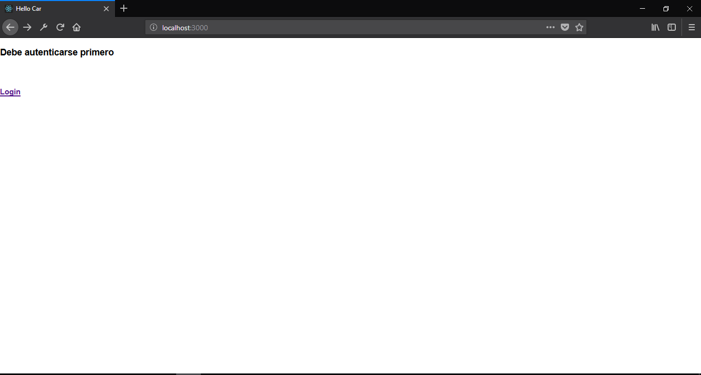
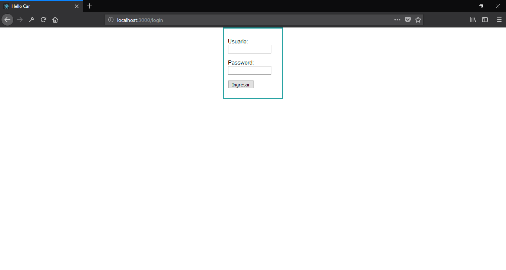
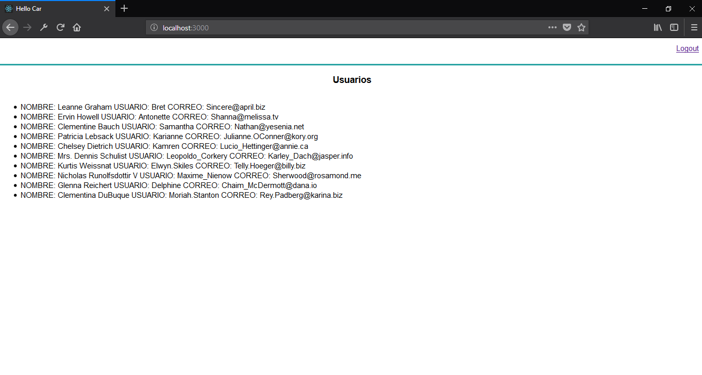

.. -*- coding: utf-8 -*-
Autenticación && Usuarios
====================
Aplicación que muestra una lista de personas después de autenticarse

Notas
=======================
-   **Autenticarse**, con el user *frodo* y contraseña *miprecioso*
-   **Acceder**, en consola, hasta la carpeta *hello-car*
-   **Instalar**, los módulos necesarios con *npm install*
-   **Empezar**, *npm start*

Capturas
=======================
Usted verá el ruta *Protegida*:

Usted verá el ruta *Login*:

  
Usted verá *Usuarios*:

Usted verá el ruta *Logout*:
.. image:: ./AppWeb/public/Logout.png
  :alt:
  :align: center
